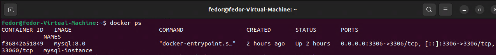
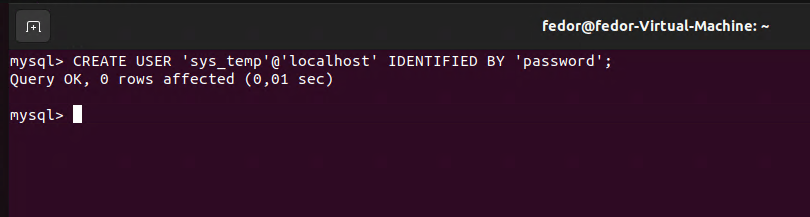
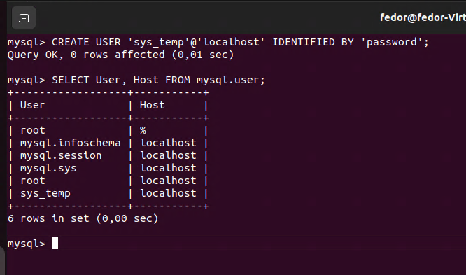
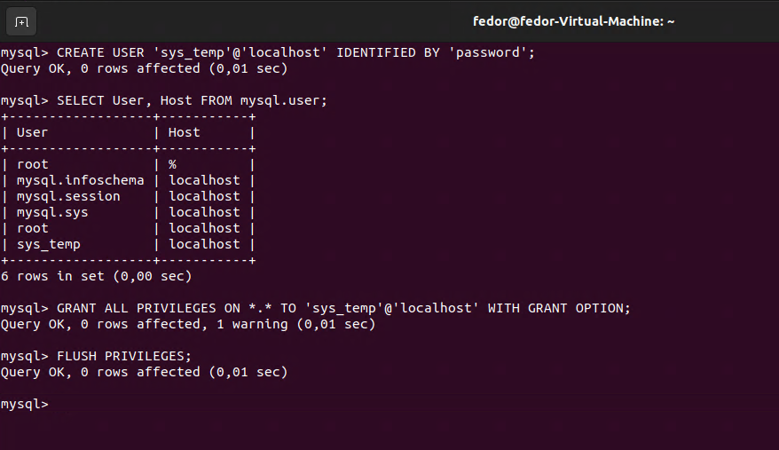
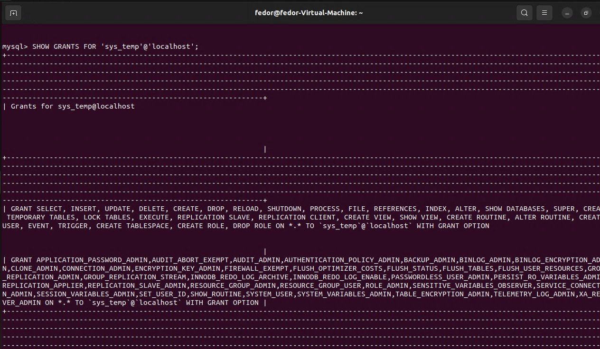
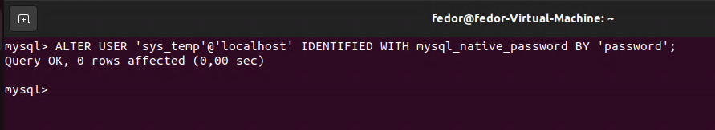
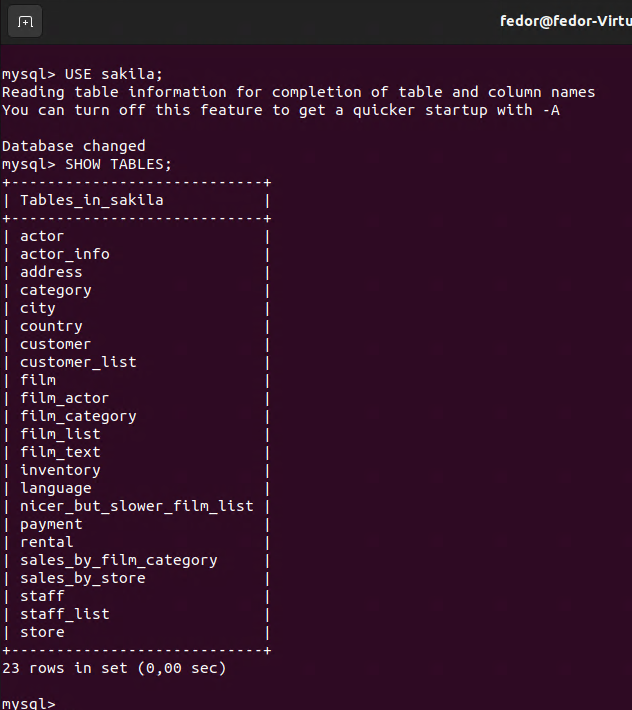
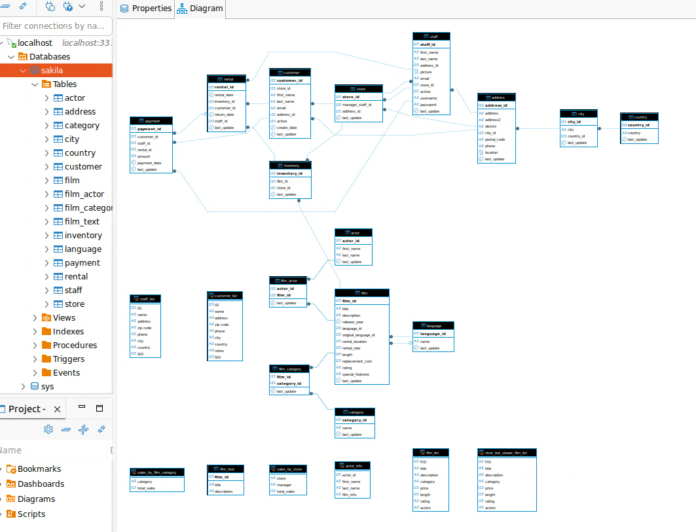
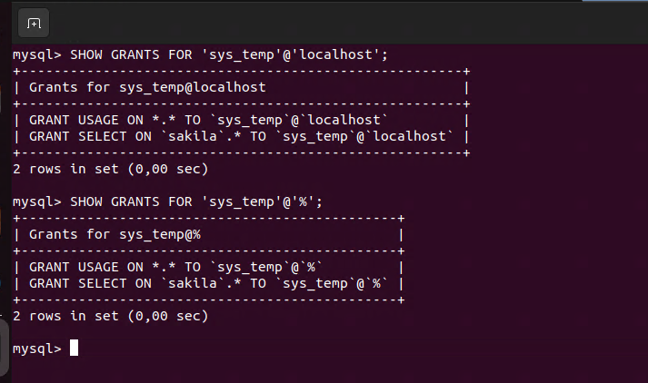

# Домашнее задание к занятию «Работа с данными (DDL/DML)» - Лунев Федор Владимирович
---

Задание можно выполнить как в любом IDE, так и в командной строке.

### Задание 1
1.1. Поднимите чистый инстанс MySQL версии 8.0+. Можно использовать локальный сервер или контейнер Docker.

1.2. Создайте учётную запись sys_temp. 

1.3. Выполните запрос на получение списка пользователей в базе данных. (скриншот)

1.4. Дайте все права для пользователя sys_temp. 

1.5. Выполните запрос на получение списка прав для пользователя sys_temp. (скриншот)

1.6. Переподключитесь к базе данных от имени sys_temp.

Для смены типа аутентификации с sha2 используйте запрос: 
```sql
ALTER USER 'sys_test'@'localhost' IDENTIFIED WITH mysql_native_password BY 'password';
```
1.6. По ссылке https://downloads.mysql.com/docs/sakila-db.zip скачайте дамп базы данных.

1.7. Восстановите дамп в базу данных.

1.8. При работе в IDE сформируйте ER-диаграмму получившейся базы данных. При работе в командной строке используйте команду для получения всех таблиц базы данных. (скриншот)

*Результатом работы должны быть скриншоты обозначенных заданий, а также простыня со всеми запросами.*







.PNG)



```sql
-- 1.2 Создание исходного пользователя
CREATE USER 'sys_temp'@'localhost' IDENTIFIED BY 'password';

-- 1.3 Список пользователей 
SELECT User, Host FROM mysql.user;

-- 1.4 Предоставление прав (для @localhost)
GRANT ALL PRIVILEGES ON *.* TO 'sys_temp'@'localhost' WITH GRANT OPTION;
FLUSH PRIVILEGES;

-- 1.5 Список прав 
SHOW GRANTS FOR 'sys_temp'@'localhost';

-- 1.6 Изменение аутентификации
ALTER USER 'sys_temp'@'localhost' IDENTIFIED WITH mysql_native_password BY 'password';

-- Создание пользователя для внешнего доступа (чтобы подключаться с хоста к Docker)
CREATE USER 'sys_temp'@'%' IDENTIFIED WITH mysql_native_password BY 'password';
GRANT ALL PRIVILEGES ON *.* TO 'sys_temp'@'%' WITH GRANT OPTION;
FLUSH PRIVILEGES;

-- 1.7 Создание базы Sakila
CREATE DATABASE sakila;

-- Восстановление дампа
-- mysql -h 127.0.0.1 -u sys_temp -ppassword sakila < sakila-schema.sql
-- mysql -h 127.0.0.1 -u sys_temp -ppassword sakila < sakila-data.sql

-- 1.8 Список таблиц
USE sakila;
SHOW TABLES;
```

### Задание 2
Составьте таблицу, используя любой текстовый редактор или Excel, в которой должно быть два столбца: в первом должны быть названия таблиц восстановленной базы, во втором названия первичных ключей этих таблиц. Пример: (скриншот/текст)
```
Название таблицы | Название первичного ключа
customer         | customer_id
```
---
| Название таблицы | Название первичного ключа   |
|------------------|-----------------------------|
| actor            | actor_id                    |
| address          | address_id                  |
| category         | category_id                 |
| city             | city_id                     |
| country          | country_id                  |
| customer         | customer_id                 |
| film             | film_id                     |
| film_actor       | actor_id, film_id           |
| film_category    | film_id, category_id        |
| film_text        | film_id                     |
| inventory        | inventory_id                |
| language         | language_id                 |
| payment          | payment_id                  |
| rental           | rental_id                   |
| staff            | staff_id                    |
| store            | store_id                    |


## Дополнительные задания (со звёздочкой*)
Эти задания дополнительные, то есть не обязательные к выполнению, и никак не повлияют на получение вами зачёта по этому домашнему заданию. Вы можете их выполнить, если хотите глубже шире разобраться в материале.

### Задание 3*
3.1. Уберите у пользователя sys_temp права на внесение, изменение и удаление данных из базы sakila.

3.2. Выполните запрос на получение списка прав для пользователя sys_temp. (скриншот)

*Результатом работы должны быть скриншоты обозначенных заданий, а также простыня со всеми запросами.*

---


```sql
-- Отзыв всех глобальных прав и GRANT OPTION (для @localhost)
REVOKE ALL PRIVILEGES ON *.* FROM 'sys_temp'@'localhost';
REVOKE GRANT OPTION ON *.* FROM 'sys_temp'@'localhost';
FLUSH PRIVILEGES;

-- Выдача только SELECT на sakila (для @localhost)
GRANT SELECT ON sakila.* TO 'sys_temp'@'localhost';
FLUSH PRIVILEGES;

-- То же для @% (для полного покрытия внешних подключений)
REVOKE ALL PRIVILEGES ON *.* FROM 'sys_temp'@'%';
REVOKE GRANT OPTION ON *.* FROM 'sys_temp'@'%';
FLUSH PRIVILEGES;

GRANT SELECT ON sakila.* TO 'sys_temp'@'%';
FLUSH PRIVILEGES;

-- Список прав для пользователя sys_temp 
SHOW GRANTS FOR 'sys_temp'@'localhost';
SHOW GRANTS FOR 'sys_temp'@'%';
```
